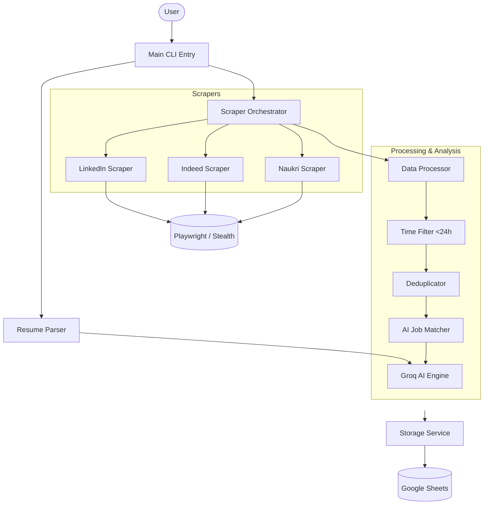
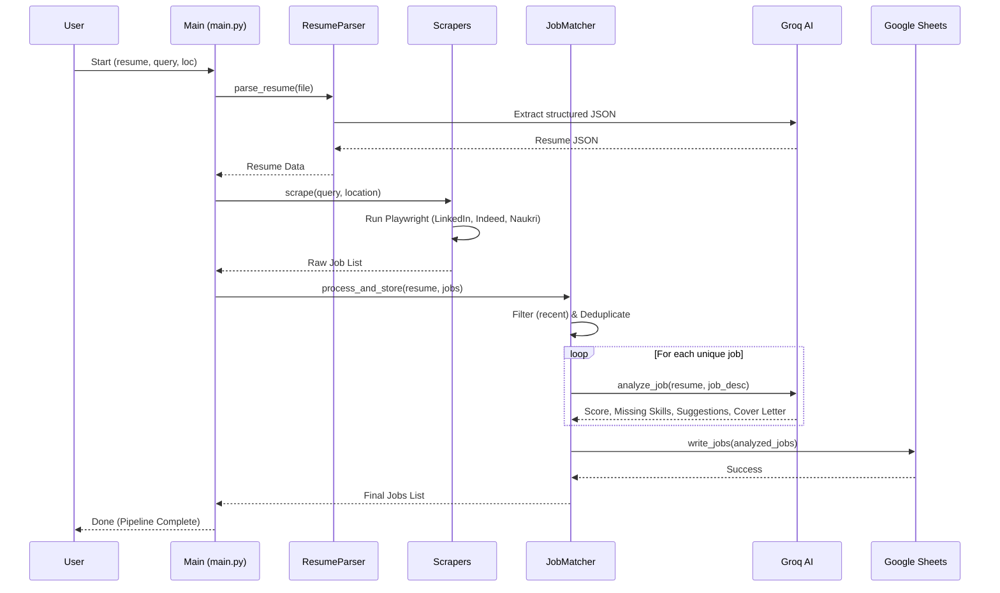

# Technical Documentation: AI Job Hunter Agent

## 1. Introduction & Motivation

### Why are we building this?
The modern job market is fragmented across multiple platforms (LinkedIn, Indeed, Naukri, etc.), making the manual process of searching, filtering, and evaluating job descriptions incredibly time-consuming. Most job seekers face three primary challenges:
1.  **Information Overload:** Hundreds of new jobs are posted daily, many of which are duplicates or irrelevant.
2.  **Time Sensitivity:** Top-tier roles often receive hundreds of applications within the first 24 hours.
3.  **Evaluation Fatigue:** Manually comparing a resume against dozens of job descriptions to determine "fit" is mentally exhausting.

**The AI Job Hunter Agent** solves this by providing a fully automated, end-to-end pipeline that discovers, filters, evaluates, and tracks job opportunities using state-of-the-art AI.

---

## 2. High-Level Architecture

The system is built using a modular micro-services inspired architecture in Python, leveraging Playwright for browser automation and Groq (LLaMA 3) for intelligence.

### High-Level Architecture Diagram

---

## 3. Project Workflow

The project follows a linear pipeline execution:

1.  **Resume Ingestion:** The user provides a PDF/DOCX resume. The system extracts raw text and uses AI to structure it into a standardized JSON format (skills, experience, etc.).
2.  **Job Discovery:** The system launches stealth browser instances to scrape LinkedIn, Indeed, and Naukri based on the user's query and location.
3.  **Refining:** 
    *   **Time Filtering:** Only jobs posted within the last 24 hours (configurable) are kept to ensure freshness.
    *   **Deduplication:** Jobs found on multiple platforms or with identical titles/companies are merged.
4.  **AI Evaluation:** Each unique job description is passed to the AI along with the parsed resume. The AI generates:
    *   A **Match Score** (0-100).
    *   A list of **Missing Skills**.
    *   Actionable **Resume Suggestions**.
    *   A **Tailored Cover Letter**.
5.  **Persistence:** The final, enriched job data is appended to a Google Sheet for the user to review and apply.

---

## 4. Sequence Diagram

This diagram illustrates the interaction between components during a typical run.

---

## 5. Technical Component Details

### Anti-Bot & Scraper Stealth
The project uses several advanced techniques to avoid detection:
*   **Playwright Stealth:** Masks browser fingerprints to look like a real user.
*   **Session Management:** Uses `cookie_manager.py` to save and reuse LinkedIn login sessions, avoiding repeated "Login Walls."
*   **Time Normalization:** `time_parser.py` converts platform-specific strings (e.g., "Posted 3 hours ago", "Just posted") into standardized timestamps for accurate filtering.

### AI Processing (Groq Engine)
*   **Model:** Uses `llama3-8b-8192` (via Groq) for high-speed, low-latency inference.
*   **Structured Output:** Prompts are designed to return strict JSON, ensuring the data can be parsed programmatically without errors.
*   **Retry Logic:** A custom `retry_handler.py` manages API rate limits and connection issues gracefully.

### Data Storage (Google Sheets)
The `sheet.py` utility handles OAuth2 authentication with Google Cloud. It automatically manages worksheet creation, header formatting, and efficient batch-appending of new job listings.
